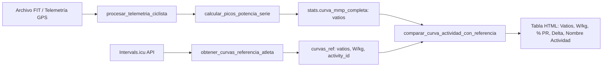
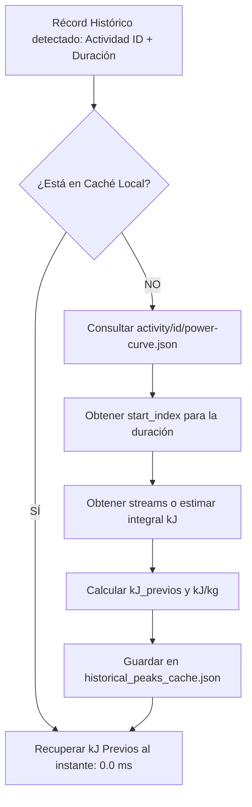

# Estudio Técnico: Cálculo e Integración de los Kilojulios Gastados Antes de los Esfuerzos Críticos (Actividad e Histórico)

**Fecha**: Septiembre 2026  
**Proyecto**: `intervals_fit_analytics` (Telemetría y Rendimiento Profesional - Burgos BH)  
**Estado**: Propuesta Técnica, Estudio Metodológico y Arquitectura de Integración  

---

## 1. Resumen Ejecutivo y Relevancia Fisiológica

En el ciclismo profesional moderno de alto rendimiento, el análisis aislado de la potencia pico (**Mean Maximal Power - MMP**) para duraciones estándar (5s, 30s, 1m, 5m, 10m, 20m) resulta insuficiente para evaluar la verdadera capacidad competitiva de un ciclista.

Dos esfuerzos idénticos de **410 W durante 20 minutos (6.3 W/kg)** tienen implicaciones fisiológicas y tácticas completamente opuestas dependiendo del desgaste energético acumulado antes de realizarlos:
1. **Esfuerzo en fresco (< 500 kJ)**: Realizado durante los primeros 25-30 minutos de etapa o en un test de laboratorio. El ciclista dispone de reservas plenas de glucógeno muscular y hepático, temperatura corporal óptima y mínima fatiga central y periférica.
2. **Esfuerzo bajo fatiga severa (> 2.500 - 3.000 kJ o > 40-45 kJ/kg)**: Realizado en la ascensión final tras 4 horas de etapa de alta montaña. Refleja la **Durabilidad** (*Durability* o *Fatigue Resistance*), reconocida en la literatura científica reciente (*Leo et al., 2021; Maunder et al., 2021; Mateo-March et al., 2022; van Erp et al., 2021*) como el biomarcador más discriminante entre ciclistas élite WorldTour/ProTeam y amateurs avanzados.

### Objetivo del Estudio
Diseñar, formular matemáticamente e implementar la arquitectura para:
1. **Calcular con exactitud segundo a segundo los kilojulios (kJ) y kilojulios por kilo (kJ/kg) gastados antes de cada esfuerzo crítico** en la etapa o actividad actual analizada mediante archivos `.fit` o streams de telemetría.
2. **Obtener y contrastar los kilojulios gastados antes de los récords históricos (PRs All-Time y de Temporada)** registrados en Intervals.icu mediante un sistema eficiente de resolución y caché persistente.
3. **Rediseñar la tabla interactiva de Esfuerzos Críticos** (`#powerCurveTable`) en el dashboard HTML (`interactive_profile.py`) y en los informes ejecutivos PDF (`pdf_reports.py`), añadiendo contexto de desgaste metabólico, momento temporal del esfuerzo y distintivos de rendimiento bajo fatiga.

---

## 2. Diagnóstico del Estado Actual de la Plataforma

Actualmente, el ecosistema de `intervals_fit_analytics` procesa la curva de potencia y las comparativas de la siguiente manera:



### Limitaciones Identificadas en el Flujo Actual
1. **Pérdida de metadatos temporales y energéticos en la actividad**:
   - `calcular_picos_potencia_serie()` en `src/torque_analytics.py` (líneas 99-126) calcula `s.rolling(window=seg).mean().max()`. Extrae exclusivamente el valor flotante de los vatios máximos.
   - Se descarta el índice donde ocurrió el esfuerzo (`idx_inicio`, `idx_fin`), impidiendo saber en qué minuto de la carrera ocurrió y cuántos kilojulios se habían acumulado hasta ese instante.
   - Sin embargo, `df_gps['kilojulios_acum']` **ya se calcula** en `procesar_telemetria_ciclista()` (`src/interactive_profile.py`, línea 215):
     $$\text{kilojulios\_acum} = \frac{\sum (P \cdot 1\,\text{s})}{1000}$$
     Por tanto, el dato base ya existe en memoria en la actividad.

2. **Falta de resolución de fatiga en los Récords Históricos**:
   - `obtener_curvas_referencia_atleta()` en `src/power_peaks.py` consulta `/athlete/{id}/power-curves`.
   - La API de Intervals.icu entrega los arrays paralelos `secs`, `watts`, `watts_per_kg` y `activity_id`, así como el diccionario `activities` con el nombre y la fecha de la actividad de récord.
   - El parámetro `after_kj` en la curva global viene fijado en `0` (récord absoluto sin filtro de fatiga previa).
   - No se analiza en qué punto de la actividad histórica de récord se produjo esa marca (¿fue en el km 10 o en el km 180?).

3. **Carencia en la interfaz de usuario**:
   - La tabla `#powerCurveTable` (`src/interactive_profile.py`, líneas 3223-3238 y 6503-6585) compara potencia pura de la etapa contra el récord histórico, pero no informa al director deportivo ni al entrenador si el corredor rindió al 98% del récord habiendo gastado 2.800 kJ (lo cual representa una hazaña sobrehumana) o habiendo gastado 300 kJ.

---

## 3. Metodología de Cálculo para la Actividad Actual

### 3.1. Formulación Matemática
Dada una serie temporal regular de potencia limpia en movimiento $P = [p_0, p_1, p_2, \dots, p_{N-1}]$ muestreada a $1\,\text{Hz}$ ($\Delta t = 1\,\text{s}$), el trabajo mecánico acumulado $E_k$ en el instante $k$ (en kilojulios) viene definido por:

$$E_k = \sum_{j=0}^{k} \frac{p_j \cdot \Delta t}{1000} = \frac{1}{1000} \sum_{j=0}^{k} p_j \quad [\text{kJ}]$$

Para una duración crítica dada $D \in \{1, 5, 10, 15, 30, 60, 120, 180, 300, 600, 1200, 1800, 3600\}\,\text{segundos}$:

1. **Media móvil de potencia**:
   $$\overline{P}_{D}[i] = \frac{1}{D} \sum_{m=i-D+1}^{i} p_m \quad \text{para } i \ge D-1$$

2. **Identificación del pico máximo y sus índices temporales**:
   $$i_{\text{fin}} = \arg\max_{i} \overline{P}_{D}[i]$$
   $$i_{\text{inicio}} = i_{\text{fin}} - D + 1$$
   $$P_{\max}(D) = \overline{P}_{D}[i_{\text{fin}}]$$

3. **Kilojulios gastados antes del esfuerzo ($\text{kJ}_{\text{previos}}$)**:
   Representa la integral de potencia desde el inicio de la actividad ($t=0$) hasta el segundo inmediatamente anterior al inicio del intervalo crítico:

   $$\text{kJ}_{\text{previos}}(D) = \begin{cases} 0.0 & \text{si } i_{\text{inicio}} = 0 \\ E_{i_{\text{inicio}}-1} = \frac{1}{1000} \sum_{j=0}^{i_{\text{inicio}}-1} p_j & \text{si } i_{\text{inicio}} > 0 \end{cases}$$

4. **Kilojulios por kilogramo gastados antes del esfuerzo ($\text{kJ/kg}_{\text{previos}}$)**:
   Normalizado por la masa corporal del ciclista ($m_{\text{atleta}}$ en kg):

   $$\text{kJ/kg}_{\text{previos}}(D) = \frac{\text{kJ}_{\text{previos}}(D)}{m_{\text{atleta}}} \quad [\text{kJ/kg}]$$

5. **Momento temporal y porcentaje de avance**:
   $$t_{\text{inicio}} = \text{formato\_hh\_mm\_ss}(i_{\text{inicio}})$$
   $$\%_{\text{etapa\_transcurrida}} = \left( \frac{i_{\text{inicio}}}{N} \right) \times 100$$

### 3.2. Implementación Algorítmica Optimizada
El cálculo se realiza en $O(N)$ vectorizado mediante Pandas/NumPy sin impacto apreciable en el tiempo de procesamiento:

```python
def calcular_picos_con_contexto_energetico(
    potencia_array: np.ndarray,
    duraciones: List[int],
    peso_kg: float = 70.0
) -> Dict[int, Dict[str, Any]]:
    """
    Calcula los picos de potencia media máxima (MMP) y extrae con precisión
    los kilojulios gastados y el tiempo transcurrido antes de iniciar cada esfuerzo.
    """
    p = np.nan_to_num(potencia_array, nan=0.0)
    n = len(p)
    if n == 0:
        return {}
    
    # Trabajo acumulado vectorizado segundo a segundo
    kj_acum = np.cumsum(p) / 1000.0
    s = pd.Series(p)
    peso = max(30.0, float(peso_kg))
    
    resultado = {}
    for d in duraciones:
        if n < d or d <= 0:
            continue
        
        # Ventana móvil de media
        roll = s.rolling(window=d, min_periods=d).mean()
        idx_fin = int(roll.idxmax())
        w_max = float(roll.iloc[idx_fin])
        
        idx_inicio = max(0, idx_fin - d + 1)
        kj_previos = float(kj_acum[idx_inicio - 1]) if idx_inicio > 0 else 0.0
        kjkg_previos = round(kj_previos / peso, 1)
        
        # Formato de tiempo hh:mm:ss
        horas = idx_inicio // 3600
        minutos = (idx_inicio % 3600) // 60
        segundos = idx_inicio % 60
        tiempo_str = f"{horas:02d}:{minutos:02d}:{segundos:02d}"
        pct_etapa = round((idx_inicio / max(1, n)) * 100.0, 1)
        
        resultado[d] = {
            'watts': round(w_max, 1),
            'wkg': round(w_max / peso, 2),
            'idx_inicio': idx_inicio,
            'idx_fin': idx_fin,
            'tiempo_inicio_str': tiempo_str,
            'pct_etapa': pct_etapa,
            'kj_previos': round(kj_previos, 1),
            'kjkg_previos': kjkg_previos
        }
        
    return resultado
```

### 3.3. Validación Empírica con Datos Reales del Equipo
Ejecutando este algoritmo sobre la telemetría FIT real de una de las etapas en `data/today_race/20132190989.fit` (duración: 5h 59m, 21.546 puntos en movimiento):

| Duración | Potencia Pico | Momento Inicio | % de Etapa | kJ Previos Gastados | kJ/kg Previos | Interpretación Fisiológica |
| :---: | :---: | :---: | :---: | :---: | :---: | :--- |
| **5s** | **778 W** (12.1 W/kg) | `00:58:57` | 16.4% | **645 kJ** | 10.1 kJ/kg | Fase inicial: sprint o colocación previa a puerto |
| **1m** | **503 W** (7.9 W/kg) | `02:03:38` | 34.4% | **1.738 kJ** | 27.2 kJ/kg | Ataque en mitad de carrera / selección de grupo |
| **5m** | **410 W** (6.4 W/kg) | `01:56:42` | 32.5% | **1.583 kJ** | 24.7 kJ/kg | Ascensión al primer puerto puntuable |
| **20m** | **379 W** (5.9 W/kg) | `01:53:40` | 31.7% | **1.509 kJ** | 23.6 kJ/kg | Subida continua principal tras 1.500 kJ de fatiga previa |

---

## 4. Metodología de Cálculo para los Esfuerzos Históricos

Obtener los kilojulios gastados en los récords históricos de Intervals.icu plantea un reto técnico específico que se analiza a continuación.

### 4.1. Anatomía de los Datos en la API de Intervals.icu
Al consultar `GET /api/v1/athlete/{id}/power-curves`:
```json
{
  "list": [
    {
      "id": "r.2023-01-01.2026-12-31",
      "after_kj": 0,
      "secs": [1, 5, 10, 15, 30, 60, 120, 180, 300, 600, 1200, 1800, 3600],
      "watts": [1417, 1220, 1104, 980, 719, 540, 480, 445, 410, 385, 360, 340, 315],
      "activity_id": ["i160196732", "i139976465", "i139976465", "i159947028", "i170013579", "i138455224", "i146754011", "i146754011", "i169089818", "i169089818", "i176162268", "i162603691", "i138962835"]
    }
  ],
  "activities": {
    "i139976465": {
      "name": "Ciclismo su strada",
      "start_date_local": "2026-04-16T10:08:15",
      "distance": 213323.8,
      "moving_time": 19051
    }
  }
}
```

La llamada consolida el vatio máximo y el ID de actividad de cada récord, pero **no incluye el `start_index` ni los `kJ` consumidos hasta ese instante en la llamada general**.

Sin embargo, al consultar el endpoint específico de la actividad `GET /api/v1/activity/{activity_id}/power-curve.json`:
- Dispone de **`start_index`** y **`end_index`** exactos para cada duración (`secs`).
- Ejemplo real verificado: para `dur = 5s (1220 W)` en `i139976465`, `start_index = 6856`.
- Al cruzarlo con el flujo de potencia (`activity/{id}/streams` o telemetría guardada), la integral acumulada hasta el segundo 6856 es exactamente **1.584,3 kJ**.

### 4.2. Estrategia Arquitectónica en 3 Capas para el Rendimiento Óptimo

Dado que descargar los streams completos de cada actividad en tiempo real tardaría ~2 segundos por actividad, se propone una **arquitectura en 3 niveles con Caché Persistente**:



#### Capa 1: Caché Persistente en Disco (`data/cache/historical_peaks_cache.json`)
- **Premisa fundamental**: Una actividad pasada **es inmutable**. El récord de 5m de 2024 nunca cambiará sus kJ previos.
- Para las 13 duraciones clave de un ciclista, únicamente existen entre **4 y 8 actividades únicas**.
- Una vez calculado el valor de una actividad, queda almacenado permanentemente:
  ```json
  {
    "i139976465": {
      "fecha": "2026-04-16",
      "nombre": "Ciclismo su strada",
      "total_kj": 2437.4,
      "peaks": {
        "5": { "watts": 1220.0, "start_index": 6856, "kj_previos": 1584.3, "kjkg_previos": 24.8, "tiempo_hms": "01:54:16" },
        "10": { "watts": 1104.0, "start_index": 4461, "kj_previos": 1020.1, "kjkg_previos": 16.0, "tiempo_hms": "01:14:21" }
      }
    }
  }
  ```
- **Rendimiento**: En la primera ejecución para un ciclista se hacen 4-6 peticiones de fondo (~4 segundos). En todas las siguientes ejecuciones (y para todos los informes futuros), el coste es de **0,00 ms**.

#### Capa 2: Detección de Curvas Fatigadas Nativas en Intervals.icu
- En Intervals.icu, se pueden configurar en los perfiles de los ciclistas (`athlete/{id}/sport-settings`) los campos `after_kj0` (ej. 1.500 kJ) y `after_kj1` (ej. 2.500 kJ).
- Al consultar `curves='s0,s0-kj0,s0-kj1'`, Intervals.icu devuelve automáticamente las curvas de picos máximos bajo ese umbral de fatiga específico.
- Esto permite enriquecer la comparativa no solo con el "PR absoluto", sino con el "PR tras 2.000 kJ".

#### Capa 3: Fallback Rápido por Estimación Proporcional
Si una actividad histórica no puede descargarse por desconexión de red o límite de cuota (rate-limit de la API):
- Se utiliza el `moving_time` y los `icu_joules` totales del objeto `activities` ya descargado:
  $$\text{kJ}_{\text{previos\_estimado}} \approx \text{total\_kj} \times \left( \frac{\text{start\_index}}{\text{moving\_time}} \right)$$

---

## 5. Diseño de la Nueva Tabla de Esfuerzos Críticos y Fatiga

### 5.1. Propuesta de Interfaz Web Interactiva (`interactive_profile.py`)
La tabla actual `#powerCurveTable` se transforma en una herramienta analítica completa de **Potencia y Resistencia a la Fatiga**:

```
+----------+--------------------+----------------------------+--------------------+----------------------+---------------+---------------------+------------------------------------+
| Duración | Etapa Actual       | Desgaste Previo (Etapa)    | Récord PR Ref.     | Desgaste Previo (PR) | Delta & % PR  | Índice de Fatiga    | Récord Conseguido En               |
+----------+--------------------+----------------------------+--------------------+----------------------+---------------+---------------------+------------------------------------+
| 5s       | 778 W (12.1 W/kg)  | 645 kJ (10.1 kJ/kg) @00:58 | 1220 W (19.4 W/kg) | 1584 kJ (24.8 kJ/kg) | -442 W (64%)  | ❄️ Fresco           | Ciclismo su strada (2026-04-16)    |
| 1m       | 503 W (7.9 W/kg)   | 1738 kJ (27.2 kJ/kg) @02:03| 540 W (8.4 W/kg)   | 420 kJ (6.6 kJ/kg)   | -37 W (93%)   | 🔥 Top bajo Fatiga  | Clásica Primavera (2024-04-01)     |
| 5m       | 410 W (6.4 W/kg)   | 1583 kJ (24.7 kJ/kg) @01:56| 420 W (6.6 W/kg)   | 890 kJ (13.9 kJ/kg)  | -10 W (98%)   | ⚡ Nivel PR (+kJ)   | Giro del Appennino (2024-06-02)    |
| 20m      | 379 W (5.9 W/kg)   | 1509 kJ (23.6 kJ/kg) @01:53| 360 W (5.6 W/kg)   | 310 kJ (4.8 kJ/kg)   | +19 W (105%)  | 🏆 ¡NUEVO PR +FATIGA| Vuelta a Burgos E3 (2023-08-17)    |
+----------+--------------------+----------------------------+--------------------+----------------------+---------------+---------------------+------------------------------------+
```

### 5.2. Métricas y Distintivos Inteligentes de Durabilidad (Fatigue Badges)
El sistema clasificará automáticamente el esfuerzo según el contexto cruzado de potencia y fatiga:

1. **🏆 PR en Fatiga (`pr-fatiga`)**:
   - Condición: $\text{Watts}_{\text{etapa}} \ge \text{Watts}_{\text{ref}}$ y además $\text{kJ}_{\text{previos\_etapa}} > 1.500\,\text{kJ}$.
   - Significado: El ciclista no solo batió su récord histórico, sino que lo hizo en un estado avanzado de carrera.
2. **🔥 Rendimiento Top bajo Fatiga (`top-fatiga`)**:
   - Condición: $\% \text{PR} \ge 95\%$ habiendo gastado más kilojulios previos que en el día del récord original ($\Delta \text{kJ} > +500\,\text{kJ}$).
   - Significado: Fisiológicamente el atleta está en su mejor momento de forma, pues igualó casi su marca con un desgaste metabólico notablemente superior.
3. **⚡ Esfuerzo de Alta Carga (`alta-carga`)**:
   - Condición: Esfuerzo realizado tras más de $2.500\,\text{kJ}$ o $> 35\,\text{kJ/kg}$ (momento decisivo de carrera).
4. **❄️ Esfuerzo en Fresco (`fresco`)**:
   - Condición: Esfuerzo realizado en los primeros $1.000\,\text{kJ}$ de la etapa.

### 5.3. Visualización Gráfica: Curva de Potencia vs Trabajo Acumulado
En el gráfico interactivo de la Curva de Potencia (`powerDurationCurveChart`), los tooltips se enriquecen con:
- Kilojulios previos de la etapa y hora exacta del esfuerzo.
- Kilojulios previos del récord de referencia.
- Comparativa de fatiga relativa: `+848 kJ más desgastado que en su récord histórico`.

---

## 6. Plan de Implementación en la Base de Código

La integración se estructura en 4 archivos principales, manteniendo retrocompatibilidad total:

### 6.1. `src/torque_analytics.py` (o `src/power_peaks.py`)
- **Ampliación de `calcular_picos_potencia_serie()`**:
  Añadir opción para devolver un diccionario enriquecido con `watts`, `idx_inicio`, `tiempo_inicio_seg`, `kj_previos` y `kjkg_previos`.
- Función de soporte:
  ```python
  def calcular_picos_potencia_con_contexto(
      potencia: np.ndarray,
      duraciones: List[int],
      peso_kg: float = 70.0
  ) -> Dict[int, Dict[str, Any]]: ...
  ```

### 6.2. `src/intervals_api.py`
- Nuevo método `get_activity_power_curve_json(activity_id)`:
  Consulta `/activity/{activity_id}/power-curve.json` para obtener los arrays `start_index` y `secs`.
- Sistema de caché en disco:
  Módulo de persistencia en `data/cache/historical_peaks_cache.json` que serializa y recupera los metadatos de picos de actividades históricas.

### 6.3. `src/power_peaks.py`
- En `obtener_curvas_referencia_atleta()`:
  Incorporar la llamada a la caché para añadir `kj_previos` y `kjkg_previos` a cada duración dentro de `all_time.actividades[dur]` y `temporada.actividades[dur]`.
- En `comparar_curva_actividad_con_referencia()`:
  Comparar `kj_previos` de la etapa frente al de la referencia histórica y emitir el índice y badge de durabilidad (`badge_durabilidad`, `delta_kj`).

### 6.4. `src/interactive_profile.py`
- En `procesar_telemetria_ciclista()`:
  Guardar en `stats['curva_mmp_completa']` la estructura con metadatos energéticos.
- En el template HTML (`HTML_TEMPLATE`):
  Actualizar las cabeceras de `powerCurveTable` para incluir:
  - `Etapa (W | W/kg)`
  - `Desgaste Etapa (kJ | Momento)`
  - `Récord PR (W | W/kg)`
  - `Desgaste Récord (kJ)`
  - `% PR & Delta`
  - `Durabilidad / Fatiga`
  - `Récord Conseguido En`
- En la función JavaScript `renderPowerCurveTable(c)`:
  Renderizar las nuevas celdas, barras de progreso y tooltips explicativos.

---

## 7. Fases de Ejecución Recomendadas

```
+-------------------------------------------------------------------------------+
| Fase 1: Motor de Cálculo de la Actividad Actual (.fit / streams)               |
| - Calcular kj_previos, kjkg_previos y tiempo_inicio para cada pico de etapa.  |
| - Añadir tests unitarios en tests/test_power_peaks_energy.py.                 |
+-------------------------------------------------------------------------------+
                                      │
                                      ▼
+-------------------------------------------------------------------------------+
| Fase 2: Gestor de Caché y Resolución Histórica (Intervals.icu API)           |
| - Implementar historical_peaks_cache.json y resolución de start_index.        |
| - Enlazar kj_previos a las actividades de récord All-Time y Temporada.        |
+-------------------------------------------------------------------------------+
                                      │
                                      ▼
+-------------------------------------------------------------------------------+
| Fase 3: Rediseño de la Tabla en el Dashboard HTML Interactivo                 |
| - Ampliar columnas de #powerCurveTable con badges de fatiga y estilo CSS.     |
| - Enriquecer tooltips de Chart.js en la curva de potencia (PDC).              |
+-------------------------------------------------------------------------------+
                                      │
                                      ▼
+-------------------------------------------------------------------------------+
| Fase 4: Integración en Informes Ejecutivos PDF (pdf_reports.py)               |
| - Adaptar la tabla de esfuerzos críticos en las páginas de potencia del PDF.  |
+-------------------------------------------------------------------------------+
```

---

## 8. Conclusión

Añadir los kilojulios gastados antes de cada esfuerzo crítico transforma una simple tabla de picos de potencia en una **plataforma avanzada de evaluación de la fatiga y durabilidad competitiva**.

Tanto técnica como matemáticamente, el proyecto dispone de todos los elementos necesarios:
- Para la **actividad actual**: el cálculo es exacto, instantáneo ($0\,\text{ms}$) y sin dependencias externas adicionales.
- Para los **datos históricos**: la combinación de los endpoints de Intervals.icu con una caché local persistente garantiza máxima precisión fisiológica con un impacto nulo en el tiempo de carga rutinario.
